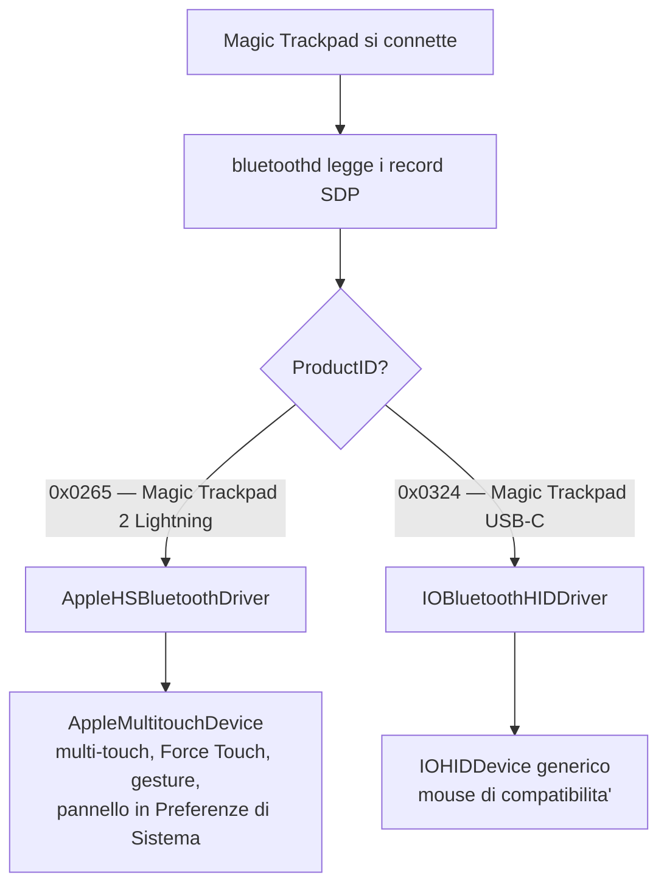
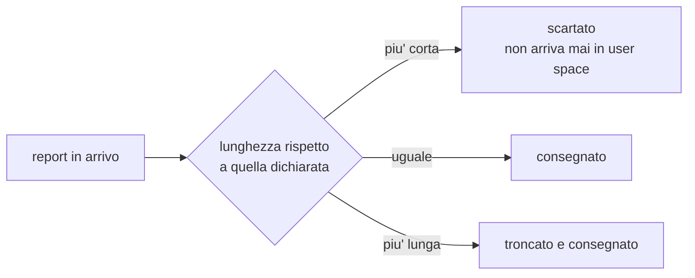

# Magic Trackpad USB-C su macOS Catalina

## In breve

macOS Catalina riconosce una Magic Trackpad USB-C solo come mouse generico:
puntatore e click, niente scroll a due dita, niente gesture.

La causa non e' una mancanza di funzionalita' del sistema. Catalina **ha
gia'** il driver nativo per la Magic Trackpad — ma registrato per il modello
**Lightning**, ProductID `0x0265`. I due modelli sono funzionalmente
identici: stesso Force Touch, stesso Taptic Engine, stesso multi-touch,
stessa superficie. Cambia il connettore, e cambia quel numero.

Il ProductID e' un valore nella cache Bluetooth di macOS, in un file di
preferenze. Riscrivendolo, il sistema affida il dispositivo al proprio
driver nativo e tutto funziona.

```bash
sudo ./sdp_patch.py --spoof-pid --addr <indirizzo bluetooth del trackpad>
sudo killall -9 cfprefsd bluetoothd
```

Poi si spegne e riaccende il trackpad. Nessun kext, nessun driver di terze
parti, SIP puo' restare attivo.

---

## 1. Il problema

| | |
|---|---|
| Sistema | macOS Catalina 10.15.8, build 19H2036 |
| Dispositivo | Apple Magic Trackpad USB-C |
| Vendor ID | `0x004C` su Bluetooth, `0x05AC` su USB |
| Product ID | `0x0324` (804) su entrambi |
| Firmware | `0x0319` |
| Sintomo | riconosciuto come mouse generico: puntatore e click, nessuna gesture |

Su macOS recenti lo stesso dispositivo funziona nativamente.

## 2. Perche' Catalina non lo riconosce

Quando un dispositivo HID Bluetooth si connette, `bluetoothd` legge i suoi
record SDP e decide a quale driver affidarlo. La decisione passa per il
ProductID.



Il driver nativo e' registrato in

```
/System/Library/Extensions/AppleTopCase.kext/Contents/PlugIns/
    AppleHSBluetoothDriver.kext/Contents/Info.plist
```

nella personality `Trackpad Device`:

```
IOClass         = AppleHSBluetoothDevice
IOProviderClass = IOBluetoothL2CAPChannel
VendorID        = 76      (0x004C)
ProductID       = 613     (0x0265)
PSM             = 17
```

`613` e' il Magic Trackpad 2 Lightning. `804` non compare da nessuna parte:
Catalina e' anteriore a quel modello.

## 3. Strade tentate che non potevano funzionare

Documentate perche' sono errori istruttivi, non perche' siano utili.

### 3.1 Iniettare una personality per il PID 804

Clonare la personality `Trackpad Device` cambiando `ProductID` da 613 a 804,
alzare `IOProbeScore`, caricarla con `kextutil -m`. La personality viene
accettata da `IOCatalogue`, ma `AppleHSBluetoothDevice` non compare mai.

**Perche' fallisce.** L'instradamento del canale L2CAP non e' una gara fra
personality: lo decide `bluetoothd` prima, e quando la personality
alternativa viene consultata il canale ha gia' un proprietario.
`IOProbeScore` ordina i candidati sullo stesso provider nello stesso istante
di matching; non revoca un attach avvenuto.

Inoltre `AppleHSBluetoothDevice` non e' un driver HID generico: "HS" e' il
percorso proprietario Apple, con una sequenza di inizializzazione specifica
del modello.

**La lezione.** Si stava modificando il *driver* perche' accettasse il
dispositivo. La soluzione e' modificare il *dispositivo* perche' dichiari
cio' che il driver gia' accetta — perche' quel valore viene letto **prima**,
da chi decide l'instradamento.

### 3.2 Intercettare il traffico Bluetooth con PacketLogger

Utile per l'analisi, inutile come soluzione. Lo scrubbing dei payload HID lo
applica `bluetoothd` in base al privilegio del consumatore, non la CLI: la
GUI vede tutto perche' e' firmata Apple. Anche riuscendo, si otterrebbe una
pipeline di debug con root e un'app aperta, non un driver.

### 3.3 Il cavo USB

Su USB il dispositivo espone tre interfacce — mouse di compatibilita',
canale vendor, telemetria della batteria — e il report multitouch **non e'
dichiarato nel report descriptor**. Su USB il descriptor viene letto dal
dispositivo e non e' modificabile. Doppio muro.

## 4. Il protocollo multitouch

Documentato perche' e' di per se' informazione utile, verificata sul
dispositivo. Riferimento incrociato: `drivers/hid/hid-magicmouse.c` del
kernel Linux, che gestisce esplicitamente
`USB_DEVICE_ID_APPLE_MAGICTRACKPAD2_USBC = 0x0324`.

### 4.1 Identificazione

Il vendor ID **cambia col transport**, ed e' un errore facile:

| Transport | VendorID | ProductID |
|---|---|---|
| USB | `0x05AC` — vendor USB di Apple | `0x0324` |
| Bluetooth | `0x004C` — company identifier Bluetooth | `0x0324` |

Il matching IOKit va quindi fatto sul solo ProductID, verificando il vendor
dopo.

### 4.2 Abilitazione del multitouch

| Transport | Tipo | Report ID | Payload |
|---|---|---|---|
| Bluetooth | feature | `0xF1` | `F1 02 01` |
| USB | feature | `0x02` | `02 01` — due byte |

Il primo byte del payload **e' il report ID**. Va rinviato a ogni
riconnessione: dopo sleep o spegnimento il dispositivo torna in modalita'
mouse. All'avvenuto cambio di modo il mouse di compatibilita' smette di
trasmettere: e' il segnale che ha funzionato.

### 4.3 Struttura del report

| Transport | Report ID | Header | Per contatto |
|---|---|---|---|
| Bluetooth | `0x31` | 4 byte | 9 byte |
| USB | `0x02` | 12 byte | 9 byte |

Su USB il report ID del multitouch **coincide con quello del mouse**: si
distinguono solo dalla lunghezza, 7 byte il mouse contro `12 + 9n`.

Lunghezze Bluetooth: 13 byte un dito, 22 due, 31 tre.

### 4.4 Decodifica di un contatto

Con `t[0..8]` i nove byte del contatto:

```
x           = (t[1] << 27 | t[0] << 19) >> 19        // 13 bit con segno
y           = -((t[3] << 30 | t[2] << 22 | t[1] << 14) >> 19)
touch_major = t[4]
touch_minor = t[5]
size        = t[6]
pressure    = t[7]
state       = t[3] & 0xC0      // 0x80 = dito appoggiato
id          = t[8] & 0x0F      // tracking id, stabile per tutto il contatto
orientation = (t[8] >> 5) - 4
```

Gli shift fanno l'estensione del segno: portano il bit alto in cima a un
intero a 32 bit e applicano uno shift aritmetico.

**Tre insidie**, tutte sperimentate:

1. Lo **stato** sta nei due bit alti di `t[3]`, non in `t[7]`. `t[3]` porta
   sia i due bit alti di y sia i bit di stato, e `t[7]` e' la pressione. Il
   Magic Trackpad di prima generazione usava `t[8]`, ed e' un errore facile
   da ereditare leggendo il ramo sbagliato del driver.
2. La macchina a stati di un contatto e': `0x00` (nessuno) → `0x40`
   (inizio) → `0x80` (appoggiato) → `0xC0` (rilascio). Solo `0x80` conta
   come dito giu'.
3. Il verso degli assi: dopo la decodifica **x cresce verso destra e y verso
   il basso**, cioe' verso il bordo vicino a chi usa il trackpad — la stessa
   convenzione dello schermo. La negazione nella formula di y serve proprio
   a ottenere questo; chi la copia e poi tratta y come crescente verso
   l'alto inverte tutto il verticale.

Range del sensore: x da -3678 a +3934, y da -2478 a +2587, circa 160 x 115 mm.

Il byte `data[1]` dell'header porta lo stato del pulsante fisico nei bit
bassi e un timestamp nei restanti.

## 5. La regola con cui IOHIDFamily filtra i report

Scoperta misurando, e vale la pena conoscerla perche' e' generale.

Su macOS il report descriptor pubblicato per un dispositivo HID Bluetooth
non viene letto dal dispositivo: viene preso dai record SDP messi in cache.
E IOHIDFamily usa la lunghezza dichiarata li' dentro per filtrare i report
in ingresso.



Misurato:

| Dichiarato | report da 13 (1 dito) | da 22 (2 dita) | da 31 (3 dita) |
|---|---|---|---|
| 94 byte | scartato | scartato | scartato |
| 13 byte | consegnato | troncato a 13 | troncato a 13 |
| 22 byte | scartato | consegnato | troncato a 22 |

**Conseguenza.** Un descriptor dichiara una lunghezza sola, ma i report
multitouch ne hanno tre diverse. Chi volesse leggerli da user space deve
scegliere fra "vedo sempre il primo dito soltanto" e "vedo due dita ma solo
quando ce ne sono almeno due". Nessuna delle due basta per un trackpad
completo.

E' il motivo per cui la strada dell'emulazione in user space, per quanto
funzionante, resta un ripiego.

## 6. La soluzione

Riscrivere il ProductID nella cache Bluetooth.

Non e' il tentativo del punto 3.1 al contrario: li' si modificava il driver,
qui il dispositivo. E il numero riscritto e' quello che `bluetoothd` legge
**prima** di scegliere il driver.

E non si sta spacciando un dispositivo per un altro: e' verificato che questa
trackpad, su Bluetooth, parla esattamente il protocollo che il driver nativo
si aspetta dal PID `0x0265` — `F1 02 01` seguito da report `0x31` nel formato
del Magic Trackpad 2. Il ProductID e' l'unica cosa che li distingue.

### 6.1 Dove si nasconde il ProductID

In `/Library/Preferences/com.apple.Bluetooth.plist`, e **non in un punto
solo**. Cambiare le sole chiavi di comodo non ha effetto.

```
com.apple.Bluetooth.plist
├── DeviceCache
│   └── <indirizzo>
│       ├── ProductID ............................ chiave di comodo
│       └── Services ............................. blob binario
│           └── <plist NSKeyedArchiver>
│               └── $objects
│                   ├── record SDP interpretato
│                   │   └── "0202 - ProductID"
│                   │       └── DataElementValue ... il valore che conta
│                   ├── record SDP ancora binario
│                   │   └── 09 02 02 09 03 24 ...... attributo 0x0202 + uint16
│                   └── report descriptor HID
└── CoreBluetoothCache
    └── <UUID>  (stesso dispositivo, riconoscibile da DeviceAddress)
        ├── ProductID
        └── Services ............................. seconda copia di tutto
```

Le tre forme in cui lo stesso numero puo' presentarsi:

| Forma | Aspetto |
|---|---|
| chiave di comodo | `ProductID : 804` |
| valore SDP interpretato | `{DataElementType: 1, DataElementSize: 2, DataElementValue: 804}` |
| record SDP binario | `09 02 02 09 03 24` — attributo `0x0202` seguito dal valore uint16 |

### 6.2 Procedura

Il trackpad dev'essere connesso via Bluetooth.

**1.** Verificare dove compare il ProductID:

```bash
sudo ./sdp_patch.py --show-pid --addr 04:B5:B2:7A:B9:8F
```

**2.** Applicare la sostituzione. Il backup del plist e' automatico:

```bash
sudo ./sdp_patch.py --spoof-pid --addr 04:B5:B2:7A:B9:8F
sudo killall -9 cfprefsd bluetoothd
```

**3.** Spegnere e riaccendere il trackpad, attendere la riconnessione.

**4.** Verificare:

```bash
ioreg -r -c AppleHSBluetoothDevice -l | head -40
```

Se compare, il dispositivo e' nativo: multi-touch completo, Force Touch,
gesture, pannello nelle Preferenze di Sistema.

### 6.3 Ripristino

```bash
sudo ./sdp_patch.py --restore
sudo killall -9 cfprefsd bluetoothd
```

### 6.4 Manutenzione

`bluetoothd` puo' rifare la query SDP dopo un ri-accoppiamento o un
aggiornamento e riscrivere il ProductID originale. Il trackpad torna allora
a comportarsi da mouse. Si verifica con `--show-pid`: se ricompare `804`, si
riapplica `--spoof-pid`.

### 6.5 SIP

La soluzione scrive in `/Library/Preferences`, che **non** e' protetto da
System Integrity Protection: serve `sudo`, non serve SIP disattivato.

E' una differenza sostanziale rispetto alla strada del kext, che avrebbe
richiesto SIP disattivato in permanenza e codice kernel non firmato caricato
a ogni avvio. Se SIP e' stato disattivato durante i tentativi, va riabilitato
da Recovery con `csrutil enable`.

## 7. Lezioni di metodo

**Verificare se il vincolo e' quello giusto, prima di piegarci il software
attorno.** L'informazione decisiva — che Catalina conosce il PID 613 — era
disponibile dal primo minuto, nella personality del driver. Sono state
percorse strade software sempre piu' complesse trattando il ProductID come
un dato immutabile dell'hardware, mentre era un numero di sedici bit in un
file di preferenze.

**Misurare invece di dedurre.** Ogni ipotesi formulata per analogia si e'
rivelata sbagliata: il vendor ID uguale su entrambi i transport, il payload
di abilitazione di nove byte, l'header di sei byte su USB, il riempimento
dei report corti, il verso dell'asse y. Ogni volta che si e' misurato si e'
avanzato.

**Le fonti primarie battono la memoria.** Il codice del driver Linux ha dato
in cinque minuti le costanti esatte che un intero ciclo di tentativi alla
cieca non aveva trovato.

**Un test su dati sintetici vale anche quando passa.** La differenza fra i
quattro punti trovati in un plist ricostruito e i due trovati in quello reale
e' cio' che ha rivelato che il cercatore guardava nel posto sbagliato.

**Distinguere il ripiego dalla soluzione, e dirlo.** L'emulazione in user
space funzionava, ma restituiva un trackpad del 2005. Chiamarla soluzione
avrebbe chiuso l'indagine un passo prima di quella vera.

## 8. Riferimenti

- Specifiche Magic Trackpad (USB-C): https://support.apple.com/en-us/121932
- Specifiche Magic Trackpad 2: https://support.apple.com/en-us/111884
- `drivers/hid/hid-magicmouse.c`, kernel Linux — protocollo dei dispositivi
  multitouch Apple, con supporto esplicito al PID `0x0324`
- `AppleHSBluetoothDriver.kext/Contents/Info.plist` — personality native di
  Catalina per i dispositivi Apple multitouch Bluetooth
